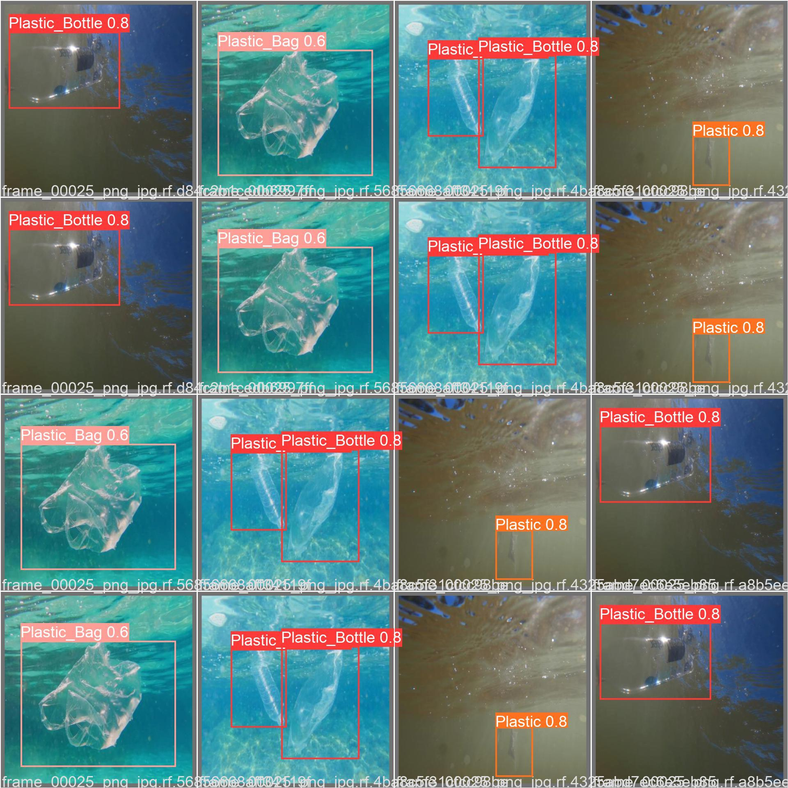
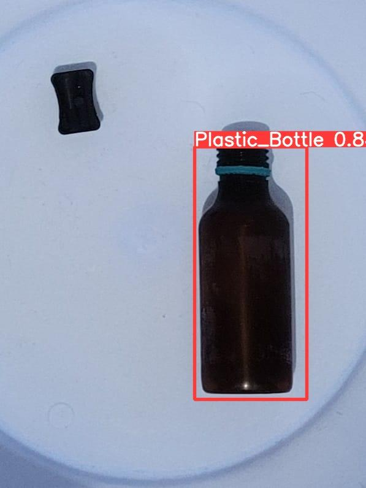
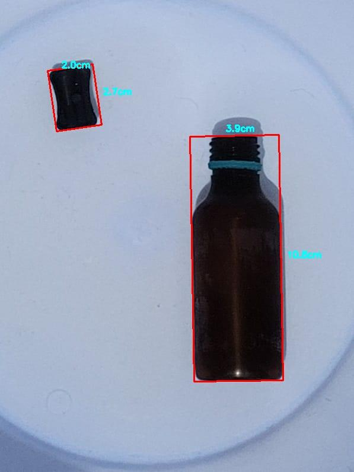

## Efficient classification, detection and analysis of submerged marine debris

### DataSet
- 1000 training images, 500 test images, 500 validation images
- Deep Sea images are from JAMSTEK JEDI dataset: http://www.godac.jamstec.go.jp/

### YOLOv5 Results

### Dimensional Calculation Results
 